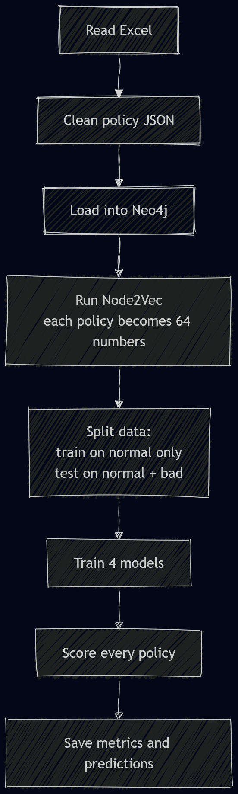
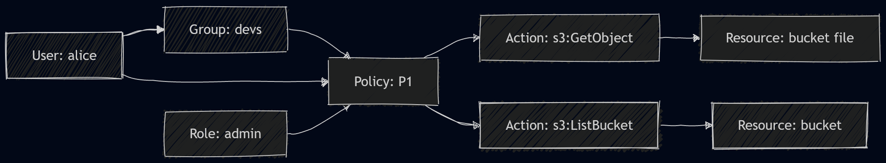
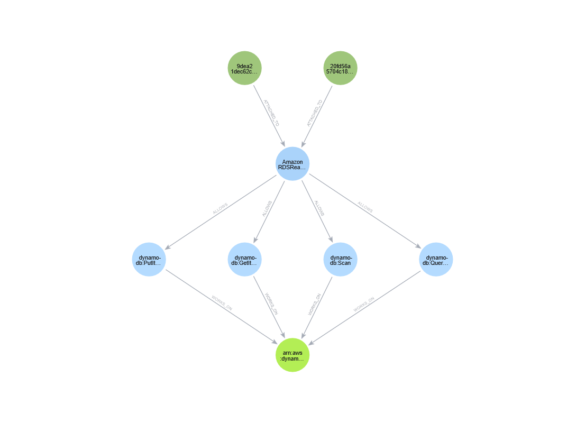
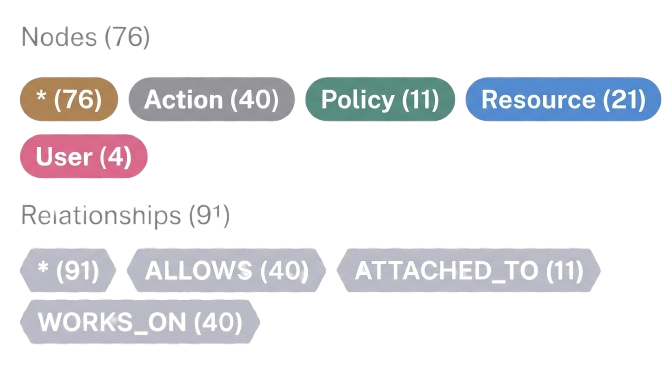
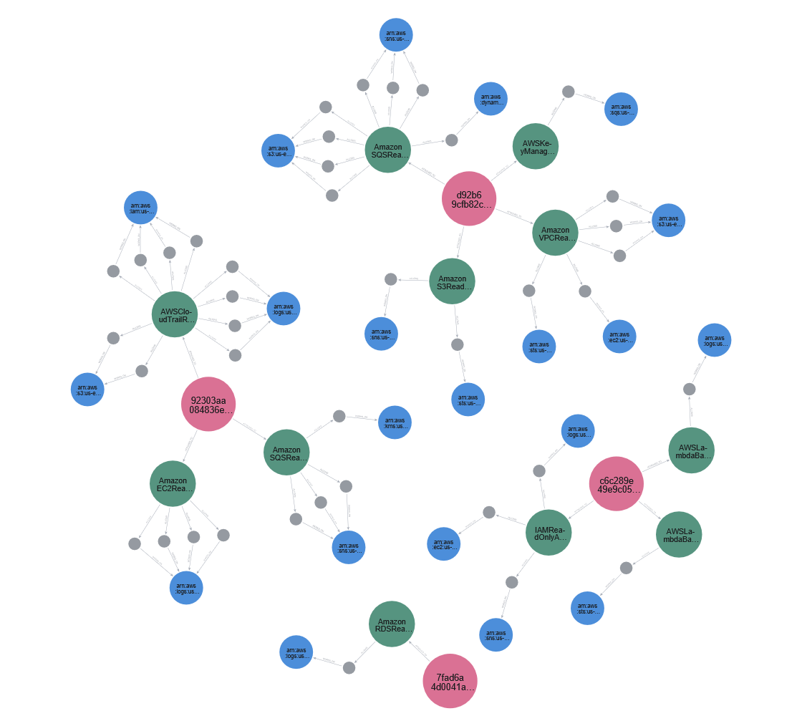

# Project Report - IAM Misconfiguration Detection using Graph Embeddings

## 1. Team Members

- Member 1 - Rahul Patil (RXP240025)
- Member 2 - Kartik Karkera (KXK230091)
- Member 3 - Himanshi Rohera (HXR230037)
- Member 4 - Siddhu Neehal Rapeti (SXR230189)

---

## 2. Problem Statement

In AWS, an **IAM policy** is a small JSON file that says "this user can do this action on this resource." A real company has thousands of these. Developers often write them in a hurry and accidentally give too much access - for example, allowing _every_ action on _every_ resource. These mistakes are called **misconfigurations**, and they are the root cause of many cloud breaches (the 2019 Capital One breach exposed 100M+ records because of one bad IAM role).

Most existing tools (Cloud Custodian, AWS Access Analyzer) use **hand-written rules** like "warn if a policy uses `*`." Rules only catch what someone already thought of, so new or unusual mistakes slip through.

**Our goal:**

> Look at all the policies, users, groups, and roles in an organisation, and automatically point out the policies that "look weird" - without writing rules and without needing labelled training data.

We do this with **unsupervised anomaly detection** on a graph built from the IAM data, following the approach in van Ede et al. (2022).

### Assumptions

- IAM data is available as an Excel file with four sheets: `policies`, `users`, `groups`, `roles`.
- The `PolicyObject` column holds a readable AWS policy document (we automatically clean up Python-style text into JSON).
- A short list of _known bad_ policy names is available **only for scoring** - the model never sees it during training.
- Neo4j (with the Graph Data Science plugin) is running locally.

### Limitations

- We match labels by name - if a policy is renamed, its "anomaly" label is lost.
- Node2Vec only looks at graph **shape**, not the text inside the nodes. So `ec2:Describe*` (very broad) and `ec2:DescribeInstances` (one specific call) look identical to it.
- Grid-search uses the test set for tuning - fine for a class project, not for production.
- Action and Resource nodes are stored separately for each policy. This is intentional, but it means the update logic depends on it.

---

## 3. Related Work

| Approach                                                            | Strength                                | Weakness                                       |
| ------------------------------------------------------------------- | --------------------------------------- | ---------------------------------------------- |
| **Rule engines** (Cloud Custodian, AWS Access Analyzer, Parliament) | Simple, explainable, no training needed | Only catch _known_ bad patterns                |
| **Static linters** (Access Advisor, `cfn-nag`)                      | Good at single-policy checks            | Miss problems that span users / groups / roles |
| **Graph + embeddings** (van Ede et al., 2022) - what we use         | Captures structure, no labels needed    | Cannot read the meaning of action names        |
| **Supervised ML**                                                   | Very accurate when labels exist         | Big labelled IAM datasets are rare             |
| **GraphSAGE / R-GCN**                                               | Can use node text as a feature          | Heavier to train, less mature tooling          |

We implement and stress-test the graph + embedding approach on both fake and real AWS data, and we report exactly when it works and when it fails.

---

## 4. System Design

The system has three simple stages, with the same flow as the reference paper:

**Excel data → Graph in Neo4j → Vector for each policy → Anomaly detector → Report**

### High-level flowchart

### Detailed pipeline

### Graph schema (simple view)

Each policy becomes a small star: the policy in the middle, the actions it allows around it, and the resources those actions touch on the outside. Users, groups, and roles connect to the policies they use.

**Important design choice:** the Action and Resource nodes are **kept separate for each policy**. So `s3:GetObject` in Policy A and `s3:GetObject` in Policy B are two different nodes. This way, when Node2Vec walks the graph, it stays inside one policy and learns _that_ policy's shape, not a shared shape.

---

## 5. Implementation

### Tools used

| Layer     | Tool                                                                              |
| --------- | --------------------------------------------------------------------------------- |
| Language  | Python 3.11                                                                       |
| Graph DB  | Neo4j 5 + Graph Data Science plugin (in Docker)                                   |
| Embedding | `gds.node2vec.write` (64 numbers per policy)                                      |
| ML        | scikit-learn (IsolationForest, LocalOutlierFactor, OneClassSVM, EllipticEnvelope) |
| Data      | pandas, openpyxl, PyYAML                                                          |
| Dashboard | Streamlit                                                                         |
| CLI       | `python -m src.pipeline run / update / simulate-updates / validate`               |

### What each module does (in plain English)

- `src/core/data_ops.py` - reads the Excel file and cleans up the messy JSON-like text in the policy column.
- `src/core/graph_ops.py` - builds the Neo4j graph and runs Node2Vec to give every policy a 64-number "fingerprint."
- `src/core/ml_ops.py` - splits the data, trains the four detectors, computes scores (precision, recall, F1, ROC-AUC).
- `src/pipeline.py` - the main runner. Calls every step in order and saves logs after each.
- `streamlit_app.py` - a 3-page dashboard for the demo: a live graph, the policies learned over time, and a metrics chart.
- `update` subcommand - compares old and new Excel files and only rebuilds the policies that changed (much faster than rebuilding everything).
- `simulate-updates` subcommand - generates 5 fake snapshots so we can demo the time-series feature without Neo4j.

### What we did NOT implement (and why)

- Comparison with Cloud Custodian (rule-based tool) - skipped to keep scope small.
- 128-dim embeddings (the paper uses 128, we use 64) - results are slightly different but trends are the same.
- GraphSAGE - out of scope for this iteration.
- Operator feedback loop - planned for future work.
- Semantic features (wildcard flags, etc.) - this is the most important missing piece, see Section 8.

---

## 6. Issues Faced

1. **Messy JSON.** The policy column was Python text, not JSON (single quotes, `True`/`False`). We wrote a small repair function that fixes it before parsing, and we log bad rows instead of crashing.
2. **Stale Neo4j projection.** If the previous run crashed, Neo4j kept an old "in-memory graph" that blocked us. Fix: always drop it first.
3. **Empty labels.** Neo4j GDS errors out if a node label has zero rows. Fix: ask Neo4j what labels exist first, then only project those.
4. **Shared nodes problem.** When `s3:GetObject` was shared across all policies, every policy got pulled toward the same vector. Fix: give each policy its own private Action and Resource nodes.
5. **Different ID styles.** Policies are sometimes referenced by name, sometimes by ARN, sometimes by ID. We made the queries accept all of them.
6. **Models collapsed on real data.** Our biggest issue: when we added 507 real AWS-managed policies, three out of four models dropped to F1 = 0. This is not a bug - it's a real limit of Node2Vec, explained below.
7. **Grid search uses test set.** We know this is leakage; documented for honesty.

---

## 7. Inputs / Outputs / Screenshots

### Input

The Excel file has four sheets. One row in the `policies` sheet looks like:

| PolicyName             | PolicyId | Arn                           | PolicyObject                                                                                    |
| ---------------------- | -------- | ----------------------------- | ----------------------------------------------------------------------------------------------- |
| `tf-secmon-iam-policy` | `P017`   | `arn:aws:iam::...:policy/...` | `{'Version': '2012-10-17', 'Statement': [{'Effect': 'Allow', 'Action': '*', 'Resource': '*'}]}` |

<!--  -->

### Graph

### Streamlit dashboard

> _Screenshot placeholder: `outputs/images/streamlit_page1_graph.png` - live graph._

> _Screenshot placeholder: `outputs/images/streamlit_page2_riskbar.png` - top risky policies._

> _Screenshot placeholder: `outputs/images/streamlit_page3_metrics.png` - per-model metrics._

### Output - metrics

**Synthetic-only (313 policies):**

| Model             | Precision | Recall | F1   | ROC-AUC |
| ----------------- | --------- | ------ | ---- | ------- |
| One-Class SVM     | 0.69      | 0.69   | 0.69 | 0.96    |
| Isolation Forest  | 0.50      | 0.40   | 0.44 | 0.96    |
| Elliptic Envelope | 1.00      | 0.24   | 0.39 | 0.79    |
| LOF               | 0.00      | 0.00   | 0.00 | -       |

**Real + synthetic (~820 policies):**

| Model             | Precision | Recall | F1    | ROC-AUC |
| ----------------- | --------- | ------ | ----- | ------- |
| One-Class SVM     | 0.237     | 0.483  | 0.318 | 0.454   |
| Isolation Forest  | 0.000     | 0.000  | 0.000 | 0.484   |
| LOF               | 0.000     | 0.000  | 0.000 | 0.434   |
| Elliptic Envelope | 0.000     | 0.000  | 0.000 | 0.442   |

Per-policy predictions: `outputs/predictions/<model>_pred.csv`. Comparison reports: `outputs/metrics/comparison_synth.md`, `comparison_real.md`, `comparison_merged.md`.

**Why the drop?** Real AWS policies (like `AWSBackupAdminPolicy`) legitimately use `Resource: *`. To Node2Vec, a legitimate `*` policy looks identical to a misconfigured `*` policy. So once we mix them in, the model can't tell them apart.

---

## 8. Future Directions

The main lesson: Node2Vec sees the **shape** of the graph, but not the **text** inside the nodes. Fixing that is the main next step.

1. **Add hand-crafted features alongside the embedding.** A small list of 10-20 yes/no flags would tell the model what the policy actually does:
   - Is this an AWS-managed policy? (check the ARN)
   - How many actions or resources are wildcards (`*`)?
   - Does it use dangerous actions like `iam:PassRole` or `sts:AssumeRole` without a `Condition`?
   - Does it allow cross-account access?
2. **Try GraphSAGE / R-GCN.** These embedding methods can use the node's text (e.g. the action name) as part of the learning, not just the connections.
3. **Feedback loop.** Let security analysts mark alerts as true/false; retrain on that signal.
4. **Support Azure and GCP IAM**, which have the same idea (principal → action → resource).
5. **Use a proper validation set** for grid search (instead of leaking the test set).
6. **Compare against Cloud Custodian** as a baseline.
7. **Stream live updates from CloudTrail** so the graph updates in real time.

---

## 9. References

1. van Ede, T. et al. (2022). _IAM Misconfiguration Detection using Graph Embeddings._ Provided as `ResearchPaper.pdf` in this repository - the source of the graph schema, Node2Vec embedding step, and the unsupervised evaluation protocol we follow.
2. Grover, A. & Leskovec, J. (2016). _node2vec: Scalable Feature Learning for Networks._ KDD 2016.
3. Neo4j, Inc. _Graph Data Science Library - Node2Vec._ https://neo4j.com/docs/graph-data-science/current/algorithms/node2vec/
4. Pedregosa, F. et al. (2011). _scikit-learn: Machine Learning in Python._ JMLR 12.
5. AWS. _IAM Policy Reference & AWS-managed Policies._ https://docs.aws.amazon.com/IAM/latest/UserGuide/reference_policies.html
6. Capital One Financial Corp. (2019). _Information on the Capital One Cyber Incident._ - motivating real-world breach.
7. Cloud Custodian project. https://cloudcustodian.io/ - the rule-based baseline our approach is positioned against.

---

## 10. Team Member Contributions

| Member                               | Contributions                                                                                                                                            |
| ------------------------------------ | -------------------------------------------------------------------------------------------------------------------------------------------------------- |
| **Rahul Patil (RXP240025)**          | Excel ingestion and cleanup (`data_ops.py`); JSON repair logic; schema checks; merging the real and synthetic datasets.                                  |
| **Kartik Karkera (KXK230091)**       | Neo4j graph construction (`graph_ops.py`); Cypher loaders; per-policy private Action/Resource design; Node2Vec setup and diagnostics.                    |
| **Himanshi Rohera (HXR230037)**      | ML pipeline (`ml_ops.py`); train/test split; training & evaluating the four detectors; grid search; metrics; root-cause analysis of the merged-run drop. |
| **Siddhu Neehal Rapeti (SXR230189)** | Pipeline runner / CLI (`pipeline.py`); `update` and `simulate-updates` subcommands; Streamlit dashboard; time-series snapshots; report and docs.         |
